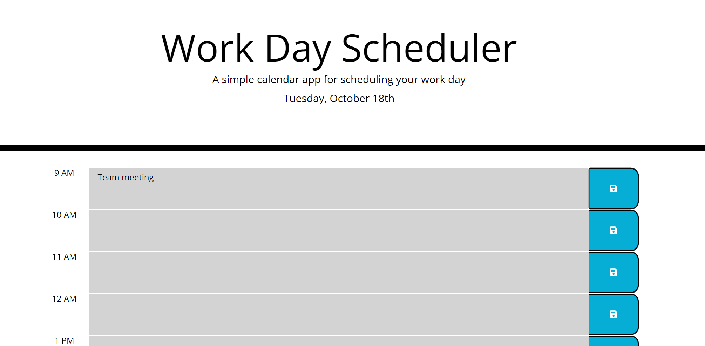

Planner 

The purpose of this application is to help a busy employee organize their day by inputting appointments and events into an hourly online schedule.
Appointments and events can be added by clicking in the desired hour, entering text, and clicking save. 
When this is done, a message will appear notifying the user that their input has been saved to local storage and the input will be visible in the designated hour. 
The color of the hour will change as the day passes to help the user quickly find the current hour which will be highlighted in red.  

URL: https://melissagon.github.io/planner/

